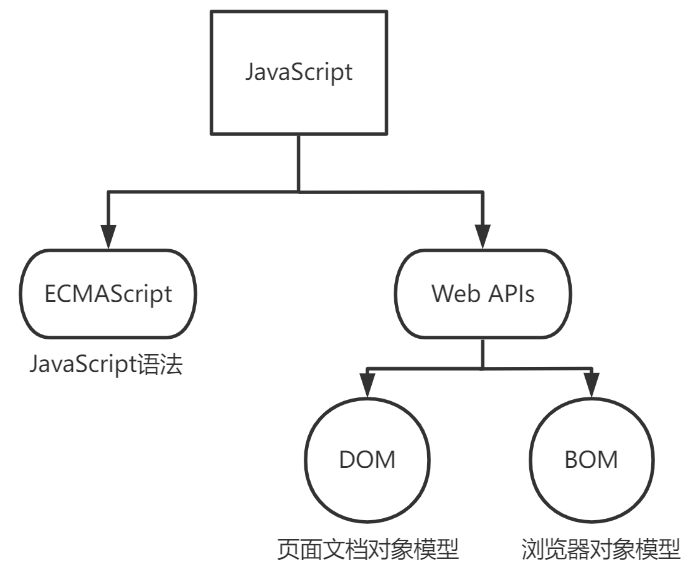
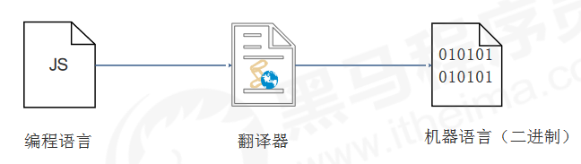

# 
1 JavaScript 简介

## 1.1 JavaScript 介绍

- JavaScript 是什么？
  - JavaScript 是世界上最流行的语言之一，是一种运行在客户端的脚本语言 （Script 是脚本的意思）
  - 脚本语言：不需要编译，运行过程中由 js 解释器( js 引擎）逐行来进行解释并执行
  - 现在也可以基于 Node.js 技术进行服务器端编程

- JavaScript 的作用？
  - 表单动态校验（密码强度检测）（ JS 产生最初的目的 ）
  - 网页特效
  - 服务端开发(Node.js)
  - 桌面程序(Electron)
  - App(Cordova)
  - 控制硬件-物联网(Ruff)
  - 游戏开发(cocos2d-js)

- HTML/CSS/JS 的关系
  - HTML 决定网页结构和内容( 决定看到什么 )，相当
  于人的身体
  - CSS 决定网页呈现给用户的模样( 决定好不好看 )，
  相当于给人穿衣服、化妆
  - 实现业务逻辑和页面控制( 决定功能 )，相当
  于人的各种动作

- 浏览器执行 JavaScript 简介
  - 浏览器分成两部分：渲染引擎和 JS 引擎
  - 渲染引擎：用来解析HTML与CSS，俗称内核，比如 chrome 浏览器的 blink ，老版本的 webkit
  - JS 引擎：也称为 JS 解释器。 用来读取网页中的JavaScript代码，对其处理后运行，比如 chrome 浏览器的 V8
  - 浏览器本身并不会执行JS代码，而是通过内置 JavaScript 引擎(解释器) 来执行 JS 代码 。JS 引擎执行代码时逐行解释每一句源码（转换为机器语言），然后由计算机去执行，所以 JavaScript 语言归为脚本语言，会逐行解释执行

- JavaScript 组成

  

- ECMAScript 是由ECMA 国际（ 原欧洲计算机制造商协会）进行标准化的一门编程语言，这种语言在万维网上应用广泛，它往往被称为 JavaScript 或 JScript，但实际上后两者是 ECMAScript 语言的实现和扩展。ECMAScript 规定了JS的编程语法和基础核心知识，是所有浏览器厂商共同遵守的一套JS语法工业标准
- 文档对象模型（Document Object Model，简称DOM），是W3C组织推荐的处理可扩展标记语言的标准编程接口。通过 DOM 提供的接口可以对页面上的各种元素进行操作（大小、位置、颜色等）
- BOM (Browser Object Model，简称BOM) 是指浏览器对象模型，它提供了独立于内容的、可以与浏览器窗口进行互动的对象结构。通过BOM可以操作浏览器窗口，比如弹出框、控制浏览器跳转、获取分辨率等
- 更多参看MDN: https://developer.mozilla.org/zh-CN/docs/Web/JavaScript/JavaScript_technologies_overview

## 1.2 JavaScript 引入方式

- 行内式
  - 代码：
    ~~~html
    <input type="button" value="点我试试" onclick="alert('Hello World')"/>
    ~~~
  - 优点：可以将单行或少量 JS 代码写在HTML标签的事件属性中（以 on 开头的属性），如：onclick
  - 缺点：可读性差， 在html中编写JS大量代码时，不方便阅读；引号易错，引号多层嵌套匹配时，非常容易弄混
  - 特殊情况下使用
  - 注意单双引号的使用：在HTML中我们推荐使用双引号, JS 中我们推荐使用单引号

- 内嵌式
  - 代码：
    ~~~js
    
    ~~~
  - 可以将多行JS代码写到 `
    ~~~
  - 优点：利于HTML页面代码结构化，把大段 JS代码独立到 HTML 页面之外，既美观，也方便文件级别的复用；适合于JS 代码量比较大的情况
  - 引用外部 JS文件的 `<script>` 标签中间不可以写代码

## 1.3 JavaScript 注释

- 单行注释
  - 单行注释的注释方式如下：
  - // 用来注释单行文字（ 快捷键 ctrl + / ）

- 多行注释
  - 多行注释的注释方式如下：
  - /* */ 用来注释多行文字（ 默认快捷键 alt + shift + a ）
  - 快捷键修改为： ctrl + shift + / 
  - vscode → 首选项按钮 → 键盘快捷方式 → 查找原来的快捷键 → 修改为新的快捷键 → 回车确认

## 1.4 JavaScript 输入输出语句

- 为了方便信息的输入输出，JS中提供了一些输入输出语句，其常用的语句如下

|       方法       |              说明              |  归属  |
| :--------------: | :----------------------------: | :----: |
|    alert(msg)    |        浏览器弹出警示框        | 浏览器 |
| console.log(msg) |    浏览器控制台打印输出信息    | 浏览器 |
|   prompt(info)   | 浏览器弹出输入框，用户可以输入 | 浏览器 |

- 注意：alert() 主要用来显示消息给用户，console.log() 用来给程序员自己看运行时的消息

## 1.5 字面量

- 在计算机科学中，字面量（literal）是用于表达源代码中一个固定值的表示法（notation）。几乎所有计算机编程语言都具有对基本值的字面量表示，诸如：整数、浮点数以及字符串；而有很多也对布尔类型和字符类型的值也支持字面量表示
  - 我们工资是:1000，此时1000就是数字字面量
  - '程序员' 是字符串字面量
  - 还有接下来我们学的 数组字面量[ ] 和 对象字面量{ } 等等

## 1.6 解释型语言和编译型语言

- 计算机不能直接理解任何除机器语言以外的语言，所以必须要把程序员所写的程序语言翻译成机器语言才能执行程序。程序语言翻译成机器语言的工具，被称为翻译器

  

- 翻译器翻译的方式有两种：一个是编译，另外一个是解释。两种方式之间的区别在于翻译的时间点不同
- 编译器是在代码执行之前进行编译，生成中间代码文件
- 解释器是在运行时进行及时解释，并立即执行(当编译器以解释方式运行的时候，也称之为解释器)

- 类似于请客吃饭：
  - 编译语言：首先把所有菜做好，才能上
  桌吃饭
  - 解释语言：好比吃火锅，边吃边涮，同
  时进行

## 1.7 标识符、关键字、保留字

- 标识符
  - 标识(zhi)符：就是指开发人员为变量、属性、函数、参数取的名字
  - 标识符不能是关键字或保留字

- 关键字
  - 关键字：是指 JS本身已经使用了的字，不能再用它们充当变量名、方法名
  - 包括：break、case、catch、continue、default、delete、do、else、finally、for、function、if、in、instanceof、new、return、switch、this、throw、try、typeof、var、void、while、with 等

- 保留字
  - 保留字：实际上就是预留的“关键字”，意思是现在虽然还不是关键字，但是未来可能会成为关键字，同样不能使用它们当变量名或方法名
  - 包括：boolean、byte、char、class、const、debugger、double、enum、export、extends、fimal、float、goto、implements、import、int、interface、long、mative、package、private、protected、public、short、static、super、synchronized、throws、transient、volatile 等
  - 注意：如果将保留字用作变量名或函数名，那么除非将来的浏览器实现了该保留字，否则很可能收不到任何错误消息。当浏览器将其实现后，该单词将被看做关键字，如此将出现关键字错误